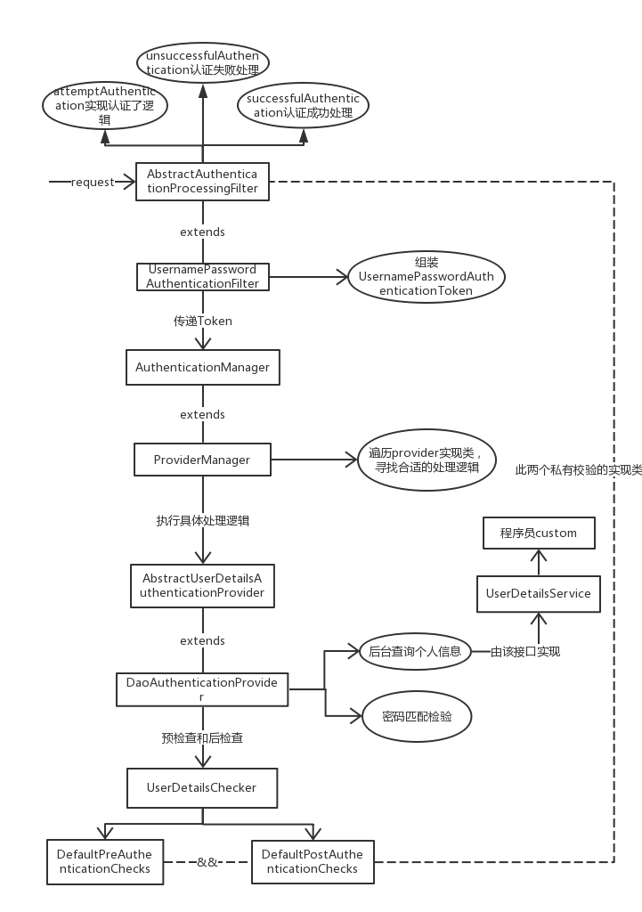
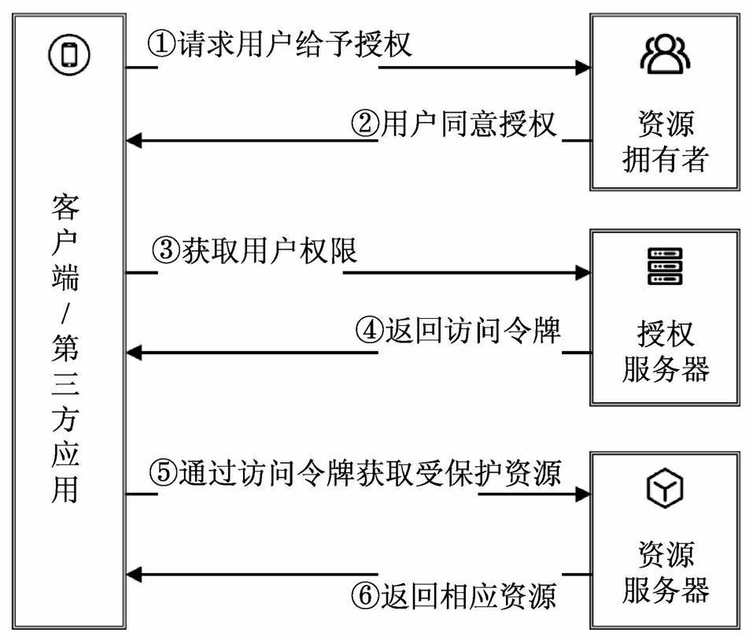

不通过zuul路由模式
 首先启动 oauth-com.louis.comment.web:
 然后 localhost:9879/api/auth/login 登录，获取预先输入进系统的账号和密码 获取token
 这个时候 可以通过postman在url的header中的key 输入“X-Authorization”，value输入“TOKEN_”+系统生成的token
 这个时候带着这个header就能访问WebSecurityConfig 有权限验证的那些路径了
 
 
 通过zuul路由模式

三部曲：
1. 配置资源服务器
2. 配置认证服务器
3. 配置spring security

四种模式
授权模式，简化模式，密码模式，客户端模式

通过zuul路由过来，然后作为认证服务器，认证完成之后，重定向到原来访问的页面

https://www.cnblogs.com/cjsblog/p/9241217.html

本模块基于spring cloud security 的认证(Authentication)和授权(Authorization)管理
## spring security:
spring security 处理逻辑是基于一系列的过滤器过滤请求的，过滤器会有一定的顺序执行doFilter()方法，
 具体处理逻辑见图（网上找到的），认证的过程就是通过这些filter操作的，在本模块中，授权是通过oauth2的资源服务器来实现的。
 
##  oauth2
oauth2 中有四个角色，分别如图，
 
oauth2默认有两个授权服务器端点
* Authorization endpoint : 用户客户端从资源所有者那里获取授权
* TokenEndpoint 用户客户端用授权许可交互访问令牌
* Redirection endpoint: 资源服务器通过资源所有者将包含授权凭证响应给客户端